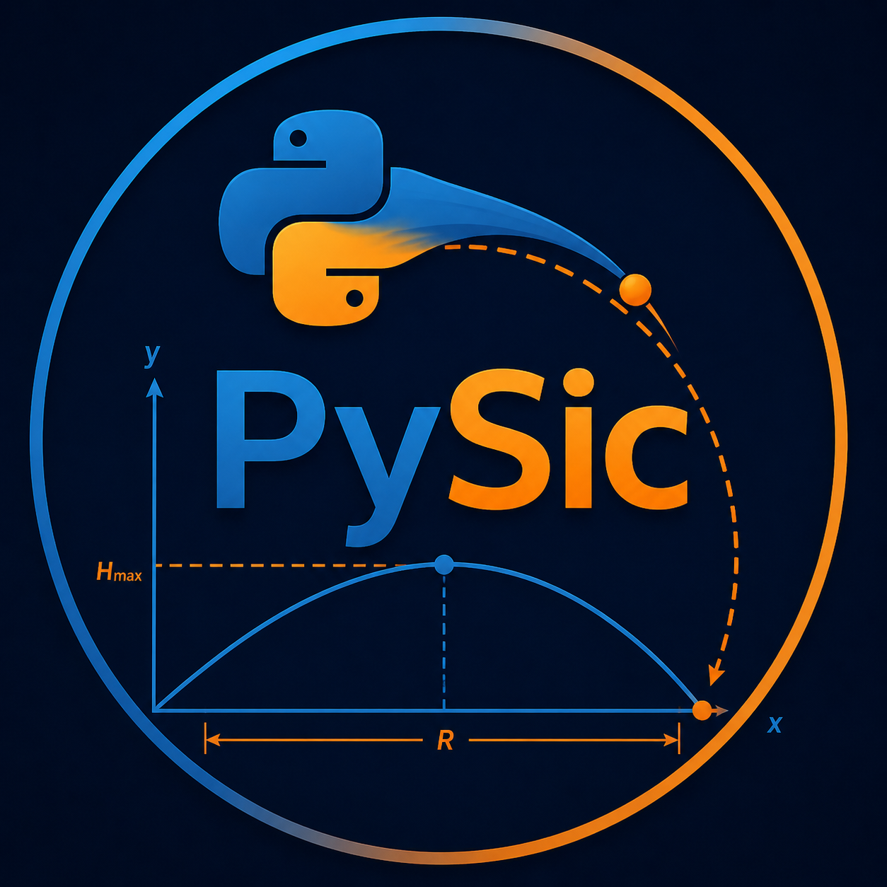
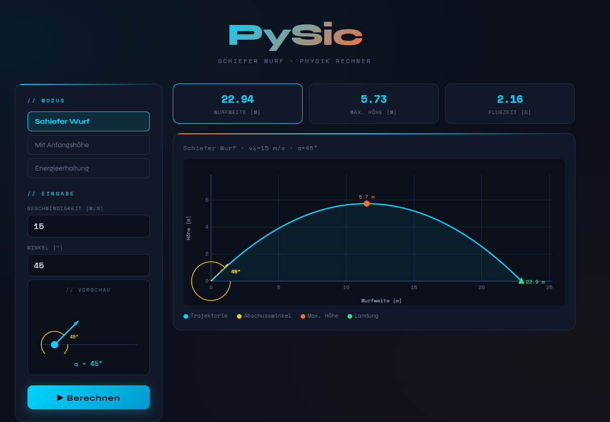
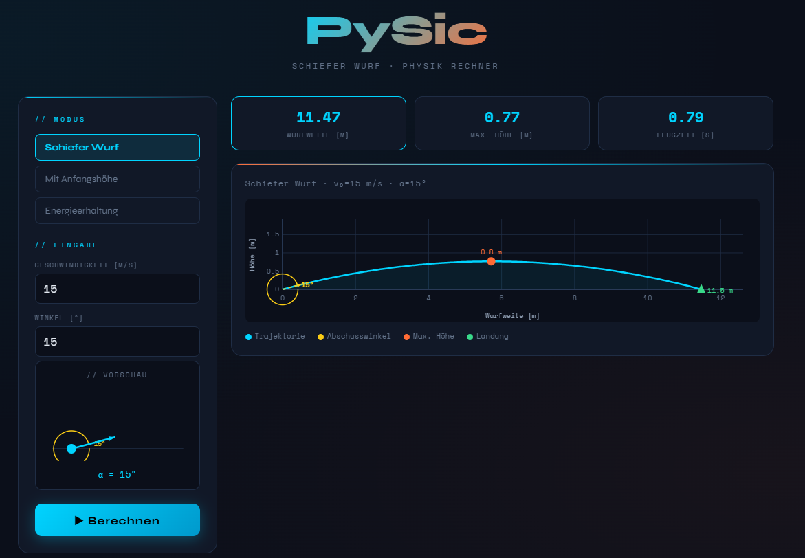
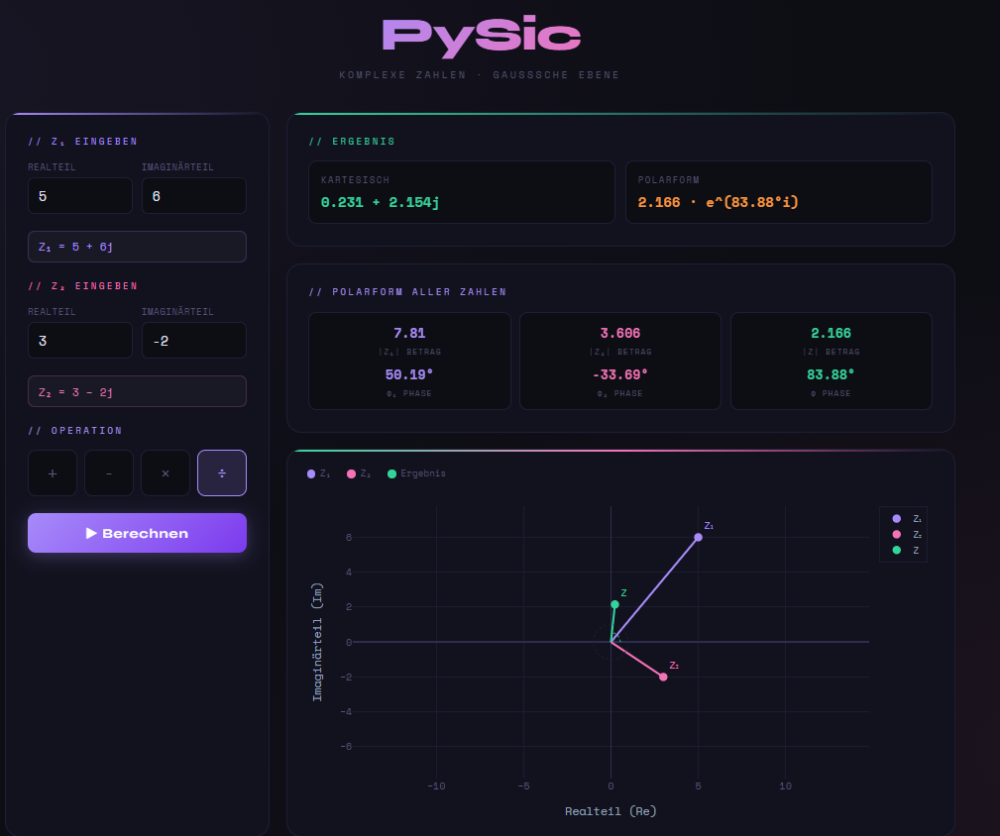
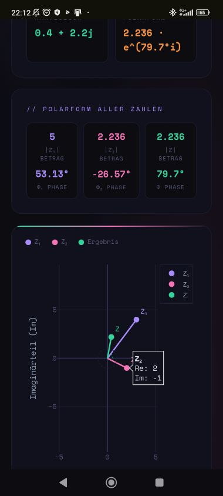

# 🚀 PySic – Physics Calculator
<p align="center">
  
</p>  
> Interactive physics calculator for projectile motion and complex numbers — built with HTML, CSS and JavaScript.


> **Note:** The app interface is currently in 🇩🇪 German.

---

## 📱 Live Demo

👉 **[pysic.github.io/PySic](https://github.com/ChristianOssinger/PySic)** 

Works on desktop and mobile — no installation needed, runs entirely in the browser.

---

## ✨ Features

### 🎯 Projectile Motion (`PySic.html`)
- **3 calculation modes:**
  - Classic projectile motion
  - With initial height (h₀)
  - Energy conservation method
- **True-scale plot** — aspect ratio matches real physics (`set_aspect('equal')`)
- **Live angle preview** — canvas animation shows launch direction as you type
- Displays: flight range, max height, flight time
- Angle arc + launch arrow visualization in plot
- Fully responsive — works on mobile

### 🔢 Complex Numbers (`PySic_Komplex.html`)
- All 4 arithmetic operations: +, −, ×, ÷
- Division implemented manually via conjugate denominator
- **Gaussian plane** visualization with Plotly.js
- Polar form (magnitude & phase) for all three numbers
- Real-time display of Z₁ and Z₂ as you type

---

## 📸 Screenshots

| Projectile Motion (45°) | Projectile Motion (15°) |
|---|---|
|  |  |

| Complex Numbers | Mobile View |
|---|---|
|  |  |

*(Screenshots in `/screenshots` folder)*

---

## 🛠️ Built With

| Technology | Purpose |
|---|---|
| HTML5 Canvas | Projectile motion plot (true scale) |
| Plotly.js | Complex number Gaussian plane |
| Vanilla JavaScript | Physics calculations |
| CSS3 | Dark theme UI |
| Google Fonts (Syne + Space Mono) | Typography |

**No frameworks. No build tools. No dependencies to install.**
Just open `PySic.html` in any browser.

---

## 🧪 Physics Behind It

### Projectile Motion
```
x(t) = v₀ · cos(α) · t
y(t) = v₀ · sin(α) · t - ½ · g · t²

Range:      x_max = v₀² · sin(2α) / g
Max height: h_max = (v₀ · sin(α))² / (2g)
Flight time: T = 2 · v₀ · sin(α) / g
```

### Complex Division (conjugate method)
```
Z₁/Z₂ = (Z₁ · Z₂*) / |Z₂|²

where Z₂* is the complex conjugate of Z₂
```

---

## 🚀 How to Use

**Option 1 — Direct download:**
1. Download `PySic.html`
2. Open in any browser
3. Done ✅

**Option 2 — Clone repository:**
```bash
git clone https://github.com/ChristianOssinger/PySic.git
cd PySic
# Open PySic.html in browser
```

---

## 📁 Project Structure

```
PySic/
├── PySic.html          # Projectile motion calculator
├── PySic_Komplex.html  # Complex number calculator
├── README.md
└── screenshots/
    ├── banner.png
    ├── 45deg.png
    ├── 15deg.png
    ├── complex.png
    └── mobile.png
```

---

## 🗺️ Roadmap

- [ ] Air resistance mode (drag coefficient)
- [ ] Animated projectile trajectory
- [ ] 3D projectile motion
- [ ] Export plot as image
- [ ] PWA support (installable on mobile)

---

## 👤 Author

**Chris** — Mechatronics technician & hobbyist developer from Austria 🇦🇹

- GitHub: [@ChristianOssinger](https://github.com/ChristianOssinger)
- LinkedIn: https://www.linkedin.com/in/christian-ossinger-3238253aa/

---

## 📄 License

MIT License — feel free to use, modify and share.

---

*Built as part of a personal physics tools collection. Inspired by university coursework in Electrical Engineering.*
